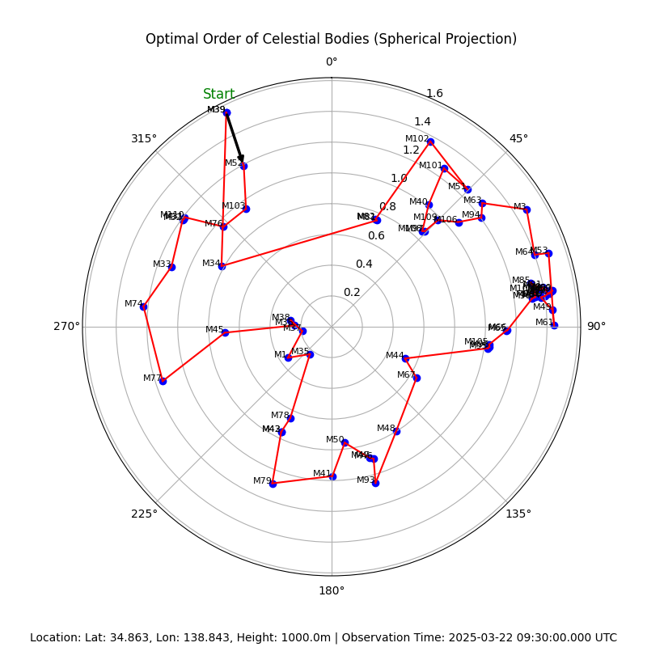

# Sphere TSP


## Overview

Sphere TSP is a Python script that calculates the optimal order of celestial bodies for observation based on their coordinates.
The script uses the Traveling Salesman Problem (TSP) algorithm to find the shortest path between celestial bodies and generates a spherical image showing the optimal order.

## Table of Contents

- [Overview](#overview)
- [Table of Contents](#table-of-contents)
- [Installation](#installation)
- [Usage](#usage)
- [Results](#results)
- [License](#license)
- [Contact](#contact)

## Installation

Follow these steps to install the project locally.

1. Clone the repository.

    ```bash
    git clone https://github.com/rioriost/sphere_tsp
    cd sphere_tsp
    ```

2. Create and activate a virtual environment.

    ```bash
    python -m venv venv
    source venv/bin/activate  # On Windows use `venv\Scripts\activate`
    ```

3. Install the required packages.

    ```bash
    pip install -r requirements.txt
    ```

## Usage

Provide the input file containing celestial coordinates and specify the observation location and time.

```bash
chmod 755 sphere_tsp.py
./sphere_tsp.py bodies.txt --lat 34.863 --lon 138.843 --height 1000 --date 2025-01-03 --time 18:00:00 --tz +9
```

## Results
```
Location: Lat: 34.863, Lon: 138.843, 1000.0m
Observation Date/Time: 2025-01-03 18:00:00 +9

Optimal Order of Celestial Bodies:
Name: NGC6922, RA: 307.47, Dec:-2.19, Altitude:15.60,  Azimuth:256.05, Observable: True
Name: M71,     RA: 298.44, Dec:18.78, Altitude:19.95,  Azimuth:279.55, Observable: True
Name: NGC7023, RA: 315.40, Dec:68.16, Altitude:42.49,  Azimuth:333.78, Observable: True
Name: M81,     RA: 148.89, Dec:69.07, Altitude:19.57,  Azimuth:16.37,  Observable: True
Name: NGC2281, RA: 102.09, Dec:41.06, Altitude:25.11,  Azimuth:56.14,  Observable: True
Name: M33,     RA: 23.46,  Dec:30.66, Altitude:83.03,  Azimuth:123.88, Observable: True
Name: M31,     RA: 10.68,  Dec:41.27, Altitude:81.91,  Azimuth:325.79, Observable: True
Name: NGC281,  RA: 13.10,  Dec:56.56, Altitude:68.02,  Azimuth:354.70, Observable: True
```



### Command-line Arguments

- `input`: Path to the input file containing celestial coordinates.
- `--lat`: Latitude of the observation location.
- `--lon`: Longitude of the observation location.
- `--height`: Height of the observation location (default: 0).
- `--date`: Observation date in YYYY-MM-DD format.
- `--time`: Observation time in HH:MM:SS format.
- `--tz`: Time zone for observation date/time (default: +9 for JST).
- `--output`: Filename for the output image (default: results.png).

## License

This project is licensed under the MIT License. See the [LICENSE](LICENSE) file for details.

## Contact

If you have any questions or suggestions, feel free to contact me.

- Name: Rio Fujita
- Email: rifujita@microsoft.com
- GitHub: [github-profile](https://github.com/rioriost)
